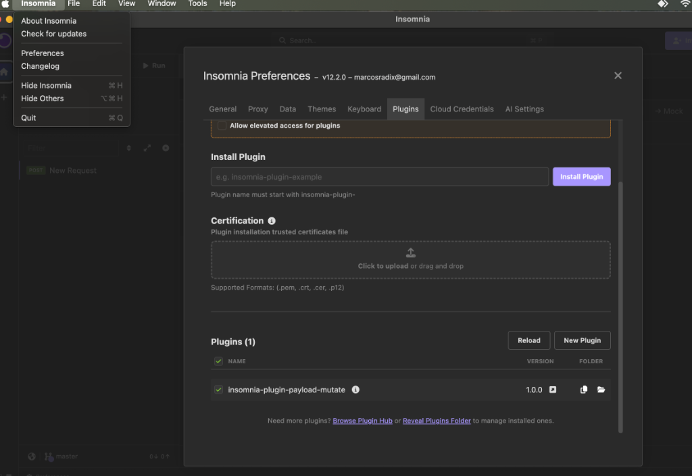

## License

This project is licensed under the MIT License.

# Insomnia Payload Converter Plugin

An Insomnia plugin that automatically converts your request payload between different formats (JSON, YAML, XML, TOML, TOON) before the request is sent.

## Features

-   **Automatic Conversion**: Converts request bodies on-the-fly based on headers or environment variables.
-   **Multi-Format Support**:
    -   JSON
    -   YAML
    -   XML (Auto-wraps roots, cleans up output)
    -   TOML
    -   TOON (Standard, Key=Value, and Annotated variants)
-   **Smart Repair**: Automatically fixes common list formatting issues (e.g., space-separated lists in brackets `[a b c]` -> `[a, b, c]`).

## Usage

### Configuration

You can control the conversion using **Headers** (per request) or **Environment Variables** (workspace-wide).

**Headers:**
-   `X-Convert-Source`: The format of your current input (e.g., `json`, `toon`). **Required**.
-   `X-Convert-Target`: The format you want to send to the server (e.g., `xml`, `json`). Defaults to `json`.


**Environment Variables:**
-   `CONVERT_SOURCE`: Default source format.
-   `CONVERT_TARGET`: Default target format.

### Supported Formats & Examples

Check out how the plugin handles different formats for the same data:

**JSON**
```json
{
	"name": "Marcos",
	"role": "Software Engineer",
	"skills": [
		"Java",
		"Dart",
		"React",
		"Angular"
	],
	"active": true,
	"experience": 9
}
```

**XML**
```xml
<?xml version="1.0" encoding="UTF-8" ?>
 <root>
     <name>Marcos</name>
     <role>Software Engineer</role>
     <skills>Java</skills>
     <skills>Dart</skills>
     <skills>React</skills>
     <skills>Angular</skills>
     <active>true</active>
     <experience>9</experience>
 </root>
```

**YAML**
```yaml
name: Marcos
role: Software Engineer
skills:
  - Java
  - Dart
  - React
  - Angular
active: true
experience: 9
```

**TOON**
(Supports standard, annotated, and key=value variants)
```toon
name: Marcos
role: Software Engineer
skills: items[4]:
    - Java
    - Dart
    - React
    - Angular
active: true
experience: 9
```

**TOML**
```toml
name = "Marcos"
role = "Software Engineer"
skills = [ "Java", "Dart", "React", "Angular" ]
active = true
experience = 9
```

## Installation

1.  Locate your Insomnia Plugins directory:
    -   **macOS**: `~/Library/Application Support/Insomnia/plugins/`
    -   **Windows**: `%APPDATA%\Insomnia\plugins\`
    -   **Linux**: `~/.config/Insomnia/plugins/`

2.  Clone or copy this repository into a new folder named `insomnia-plugin-payload-mutate` inside the plugins directory.

   ```bash
   # Example for macOS
   cp -r /path/to/project ~/Library/Application\ Support/Insomnia/plugins/insomnia-plugin-payload-mutate
   ```

3.  **Reload Plugins** in Insomnia (Preferences > Plugins > Reload Plugins).



## Development & Testing

Prerequisites: Node.js installed.

1.  **Install Dependencies:**
    ```bash
    npm install
    ```

2.  **Run Tests:**
    The project includes a test suite covering all formats.
    ```bash
    npm test
    ```
    *Output:*
    ```text
    --- Running Automated Test Suite ---
    Testing JSON Parse... PASS: JSON
    Testing YAML Parse... PASS: YAML
    Testing TOML Parse... PASS: TOML
    Testing TOON Parse... PASS: TOON
    Testing XML Parse...  PASS: XML
    ```

## Architecture
This plugin follows **Clean Architecture** principles:
-   **Domain**: `FormatConverter` interface.
-   **Use Cases**: Specific implementations (`JsonConverter`, `ToonConverter`, etc.).
-   **Adapters**: `ConverterFactory` for selecting the right converter.

## Acknowledgements
This project was created with the help of **Google Antigravity**.
